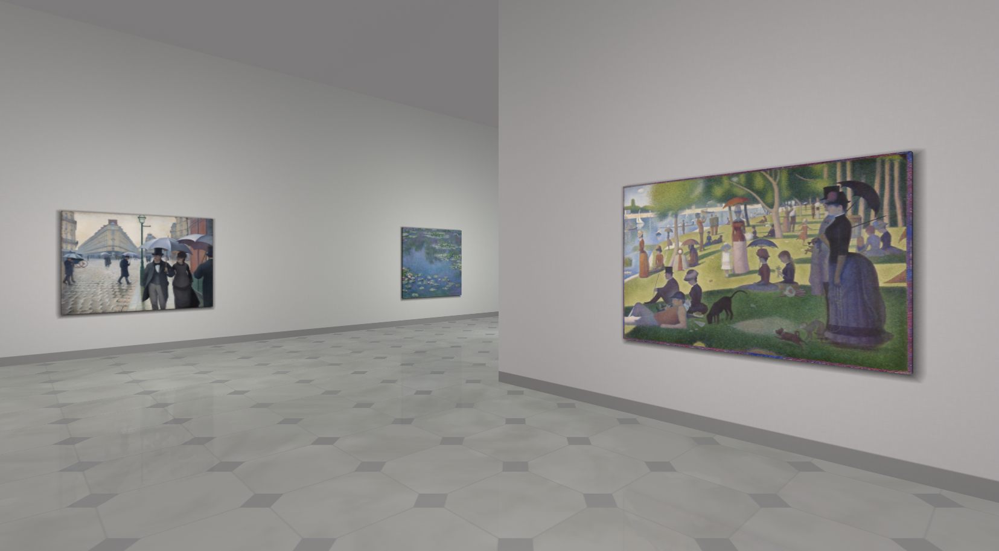

# [Virtual Art Gallery](https://clementcariou.github.io/virtual-art-gallery/build)

[](https://clementcariou.github.io/virtual-art-gallery/build)

## Description

This project simulates an art gallery in your browser using [REGL](https://github.com/regl-project/regl).
It aims at reproducing the experience of a real art gallery.
The architecture is generated using a 10km long 6th order [Hilbert Curve](https://en.wikipedia.org/wiki/Hilbert_curve).
The paintings are asynchronously loaded from the [ARTIC](https://aggregator-data.artic.edu/home) and placed on the walls.
You can use this project to display your own artworks.

## Setup

Installation :
```shell
git clone https://github.com/ClementCariou/virtual-art-gallery.git
npm install
```
Start the budo dev server : 
```shell
npm start
```
Build : 
```shell
npm build
```

## API

The [api.js](src/api.js) file can be edited to display your own artworks. It should exports a module with two asynchronious functions :
```js
// Called when a new page of images need to be loaded
fetchList(from, to) // Returns an obj {image_id}
// Called for each image loading
fetchImage(obj, advicedResolution) // Returns painting infos {title, image}
```

### Local images

In [api.js](src/api.js), a working example of local images loading is commented. 

## Evolutions

- better api
- example folder
- search, filter and sort
- painting metadata redirect
- painting logarithm scale
- dynamic ambiant sound
- props for variety
- webvr

## Known issues

- load time (we are using a reverse proxy to get around the cors policy)
- incorrect painting shadows
- ceiling lighting seams
- no specular
